This solution template is meant to provide an alternative option to deploy machine learning models registered in AML workspace to AKS clusters.

Contributor: 

[Han Zhang (Microsoft Data & AI Cloud Solution Architect)](https://www.linkedin.com/in/han-zhang-csa-msft/)

[Ganesh Radhakrishnan (Microsoft Senior App & Infra Cloud Solution Architect)](https://www.linkedin.com/in/ganesh-radhakrishnan-11217329/)

Table of Contents
=================

<!--ts-->
  * [Overview](#overview)
  * [Benefits and Advantages](#benefits-and-advantages)
  * [Prerequisites](#prerequisites)
  * [Architecture Diagram](#architecture-diagram)
  * [Step by Step Instructions](#step-by-step-instructions)
  * [License](#license)
<!--te-->

## Overview

This project provides step by step instructions to use **Azure DevOps Services** to build the application binaries, package the binaries within a container and deploy the container on **Azure Kubernetes Service** (AKS). The deployed microservice exposes a Web API (REST interface) and supports invoking a model registered in **Azure Machine Learning** workspace and running inference task on it.

## Benefits and Advantages

This solution template helps enable the following use cases:

1. Enable multi-region deployment
2. More flexibility in endpoint configuration and management
3. Model agnostic--one endpoint can invoke several models, providing the required environment is built beforehand. One environment can be reused across several models
4. Controlled roll out of model inference deployment
5. Enable higher automation across various AML workspaces for CI/CD purposes
6. The solution can be customized to retrieve models directly from Azure storage, without invoking AML workspace at all, providing further flexibility
7. The solution can be modified to include use cases beyond model inferencing. Data engineering via AKS endpoint without any specified model is also possible. 

## Prerequisites

1.  Review and complete all modules in [Azure Fundamentals](https://docs.microsoft.com/en-us/learn/paths/azure-fundamentals/) course.
2.  An Azure **Resource Group** with **Owner** *Role* permission.  All Azure resources will be deployed into this resource group.
3.  A **GitHub** Account to fork and clone this GitHub repository.
4.  An **Azure DevOps Services** (formerly Visual Studio Team Services) Account.  You can get a free Azure DevOps account by accessing the [Azure DevOps Services](https://azure.microsoft.com/en-us/services/devops/) web page.
5. An **Azure Machine Learning** workspace. AML is an enterprise-grade machine learning service to build and deploy models faster. In this project, you will use AML to register and retrieve models. 
6.  This project assumes readers/attendees are familiar with Azure Machine Learning, Git SCM, Linux Containers (*docker engine*), Kubernetes, DevOps (*Continuous Integration/Continuous Deployment*) concepts and developing Microservices in one or more programming languages.  If you are new to any of these technologies, go thru the resources below.
    - [Build AI solutions with Azure Machine Learning](https://docs.microsoft.com/en-us/learn/paths/build-ai-solutions-with-azure-ml-service/)
    - [Introduction to Git SCM](https://git-scm.com/docs/gittutorial)
    - [Git SCM Docs](https://git-scm.com/book/en/v2)
    - [Docker Overview](https://docs.docker.com/engine/docker-overview/)
    - [Introduction to .NET and Docker](https://docs.microsoft.com/en-us/dotnet/core/docker/intro-net-docker)
    - [Kubernetes Overview](https://kubernetes.io/docs/tutorials/kubernetes-basics/)
    - [Introduction to Azure DevOps Services](https://azure.microsoft.com/en-us/overview/devops-tutorial/)
7. (Optional) Download and install [Postman App](https://www.getpostman.com/apps), a REST API Client used for testing the Web API's.

## Architecture Diagram

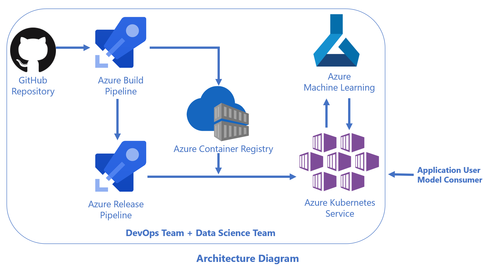

For easy and quick reference, readers can refer to the following online resources as needed.
- [Docker Documentation](https://docs.docker.com/)
- [Kubernetes Documentation](https://kubernetes.io/docs/home/?path=users&persona=app-developer&level=foundational)
- [Helm 3.x Documentation](https://docs.helm.sh/)
- [Azure Kubernetes Service (AKS) Documentation](https://docs.microsoft.com/en-us/azure/aks/)
- [Azure Container Registry Documentation](https://docs.microsoft.com/en-us/azure/container-registry/)
- [Azure DevOps Documentation](https://docs.microsoft.com/en-us/vsts/index?view=vsts)
- [Azure Machine Learning Documentation](https://docs.microsoft.com/en-us/azure/machine-learning/)

## Step by Step Instructions

### Set up Azure Devops Project

1. Go to [Azure Devops website](https://azure.microsoft.com/en-us/services/devops/?nav=min), and set up a project named **AML_AKS_custom_deployment** (Substitute any name as you see fit.)

### Set up Project

1. Go to Repos on the left side, and find **Import** under **Import a repository**

2. Use https://github.com/HZ-MS-CSA/aml_aks_generic_model_deployment as clone URL

### Upload AML Model

1. As a demonstration, we will be using an onnx model from a Microsoft Cloud Workshop activity. 
    1. "This is a classification model for claim text that will predict `1` if the claim is an auto insurance claim or `0` if it is a home insurance claim. The model will be built using a type of Deep Neural Network (DNN) called the Long Short-Term Memory (LSTM) recurrent neural network using TensorFlow via the Keras library.". [Source here.](https://github.com/microsoft/MCW-Cognitive-services-and-deep-learning/blob/main/Hands-on%20lab/notebooks/03%20Claim%20Classification.ipynb)
    2. For step by step guidance on how to create and train this model, please see the [MCW workshop here.](https://github.com/microsoft/MCW-Cognitive-services-and-deep-learning) 
    3. For your convenience, you can find the onnx model under sample_model/claim_classifer.zip
    4. Download and unzip the file, and upload the onnx model to Azure ML workspace
    
    

### Modify Azure Devops Repo Content

There are two files that need to be modified to accommodate the onnx model

1. **./main-generic.py**: This is essentially a scoring entry script that calls AML SDK, retrieve the model from the registry, and wrap it in a flask API. The original main-generic.py is a template, and you can add any relevant codes to execute the model in this file. Please replace the content of this file with **./sample_model/main-generic.py** (An example of how to customize this python script)
    1. **./sample_model/main-generic.py** is an adapted version of the original MCW-Cognitive services and deep learning Claim Classification Jupyter Notebook. [Please see source here.](https://github.com/microsoft/MCW-Cognitive-services-and-deep-learning/blob/main/Hands-on%20lab/notebooks/03%20Claim%20Classification.ipynb)
2. **./project_env.yml**: This specifies the dependencies required for the model to execute. Please replace the content of this file with **./sample_model/project_env.yml** (An example of how to customize this yml file)

### Set up Build Pipeline

1. Create a pipeline by using the classical editor. Select your Azure Repos Git as source. Then start with an empty job. 
2. Change the agent specification as **ubuntu-18.04** (same for release pipeline as well)
3. **Copy Files Activity**: Configure the activity based on the screenshot below
    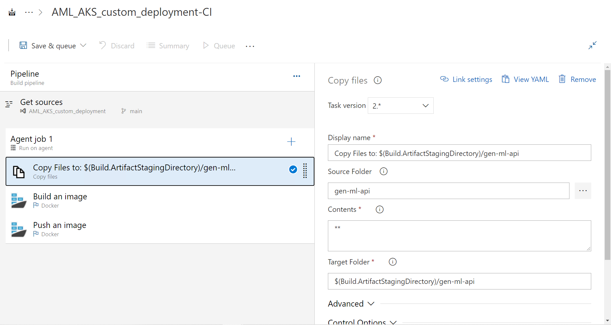
4. **Docker-Build an Image**: Configure the activity based on the notes and screenshot below
    1. Change task version to be 0.*
    2. Select an Azure container registry, and authorize Azure Devops's Azure connection
    3. In the "Docker File" section, select the **Dockerfile** in Azure Devops repo
    4. Leave everything else as default
    
    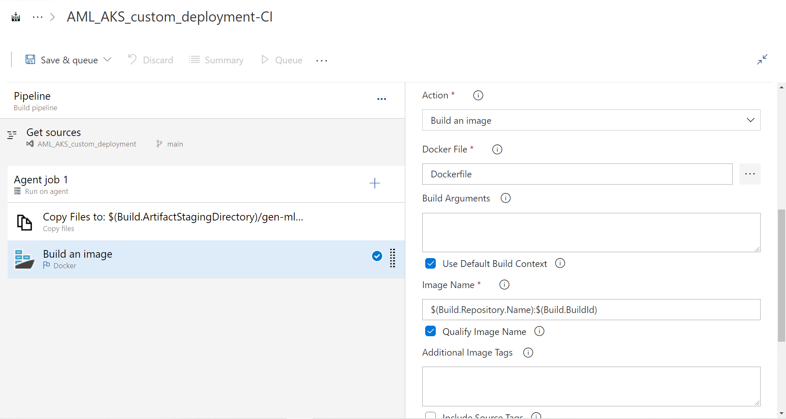
5. **Docker-Push an Image**: Configure the activity based on the notes and screenshot below
    1. Change task version to be 0.*
    2. Select the same ACR as Build an Image step above
    3. Leave everything else as default
    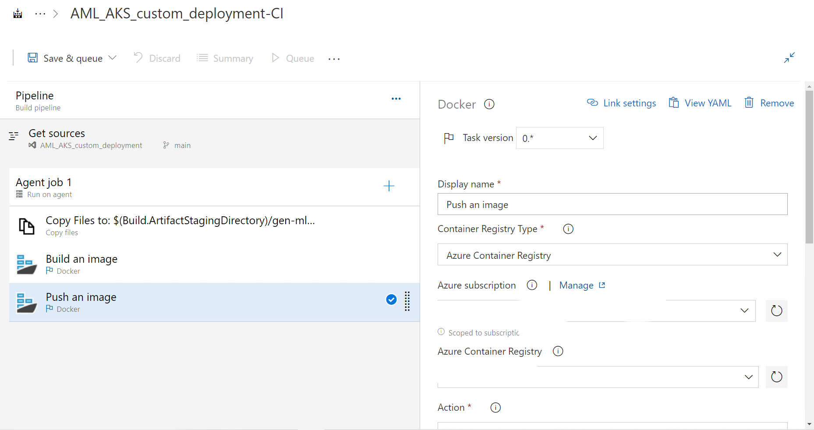
    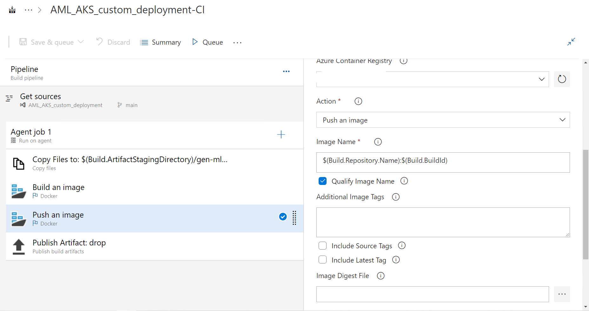
6. **Publish Build Artifact**: Leave everything as default
    
7. Save and queue the build pipeline.

### Set up Release Pipeline

1. Start with an empty job
2. Change Stage name to be AKS-Cluster-Release
    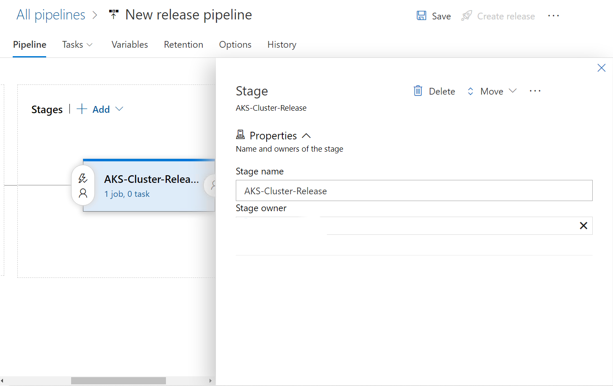
3. Add build artifact
    
4. Set up continuous deployment trigger--the release pipeline will be automatically kicked off every time a build pipeline is modified
    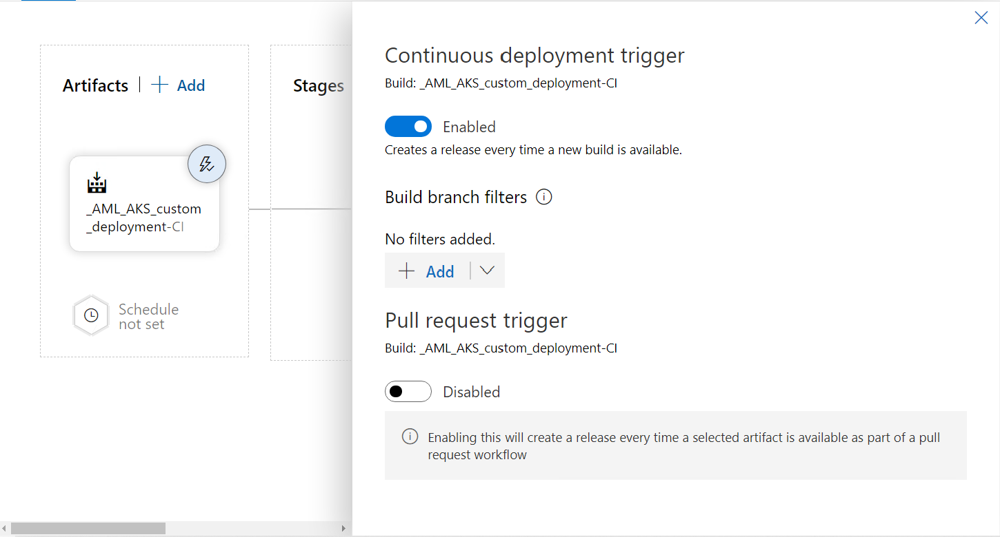
5. **helm upgrade**: *Package and deploy helm charts* activity. 
    1. Select an appropriate AKS cluster
    2. Enter a custom namespace for this release. For this demo, the namespace is *aml-aks-onnx*
    3. Command is "upgrade"
    4. Chart type is "File path". Chart path is shown in the screenshot below
    5. Set release name as *aml-aks-onnx-1*
    6. Make sure to select **Install if not present** and **wait**
    7. Go to your Azure Container Registry, and find Login server URL. Your Image repository path is LOGIN_SERVER_URL/REPOSITORY_NAME. 
    7. In arguments, enter the following content:

    `--create-namespace --set image.repository=IMAGE_REPOSITORY_PATH --set image.tag=$(Build.BuildId) --set amlargs.azureTenantId=$(TenantId) --set amlargs.azureSubscriptionId=$(SubscriptionId) --set amlargs.azureResourceGroupName=$(ResourceGroup) --set amlargs.azureMlWorkspaceName=$(WorkspaceName) --set amlargs.azureMlServicePrincipalClientId=$(ClientId) --set amlargs.azureMlServicePrincipalPassword=$(ClientSecret)`

    
    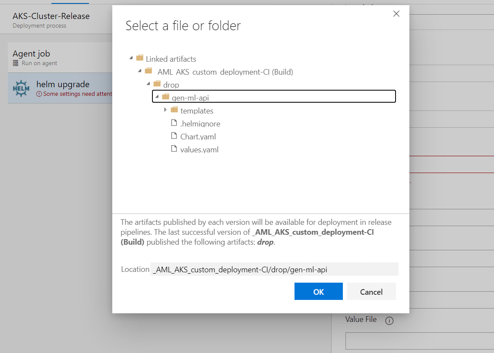
    
    
6. In Variables/Pipeline Variables, create and enter the following required values
    1. ClientId: Follow [How to: Use the portal to create an Azure AD application and service principal that can access resources](https://docs.microsoft.com/en-us/azure/active-directory/develop/howto-create-service-principal-portal) to create a service principal that can access Azure ML workspace
    2. ClientSecret: See the instruction for ClientId
    3. ResourceGroup: Resource Group for AML workspace
    4. SubscriptionId: Can be found on AML worksapce overview page. 
    5. TenantId: Can be found in Azure Activate Directory
    6. WorkspaceName: AML workspace name
    
    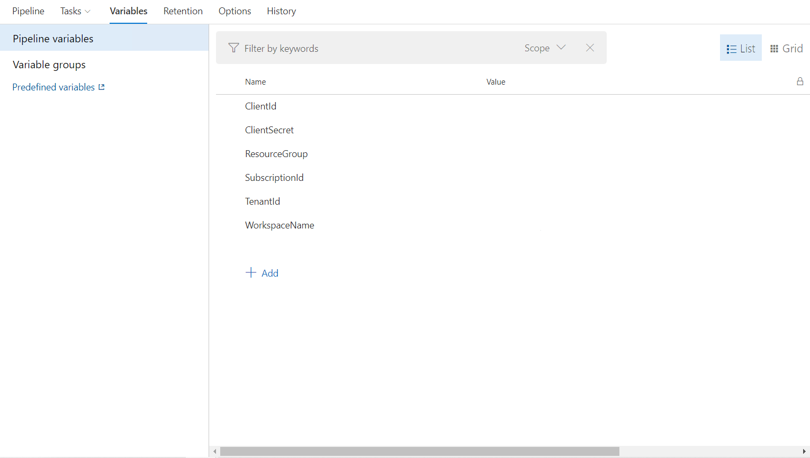
7. Save, create, and deploy release
    
    

### Testing

1. Retrieve external IP for deployed service
    1. Open powershell
    2. `az account set --subscription SUBSCRIPTION_ID`
    3. `az aks get-credentials --resource-group RESOURCE_GROUP_NAME --name AKS_CLUSTER_NAME`
    4. `kubectl get deployments --all-namespaces=true`
    5. Find the `aml-aks-onnx` namespace, make sure it's ready
    6. `kubectl get svc --namespace aml-aks-onnx`. External IP will be listed there
2. Use [test.ipynb](test.ipynb) to test it out
    1. endpoint is `http://EXTERNAL_IP:80/score`. You can optionally set it to be `http://EXTERNAL_IP:80/healthcheck` and then use the get method to do a quick health check
    2. In the post method section, make sure to enter the model name. In this demo, the model name is claim_classifier_onnx_demo. Enter any potential insurance claim text, and see the model classifies it into auto or home insurance claim in real time. 
    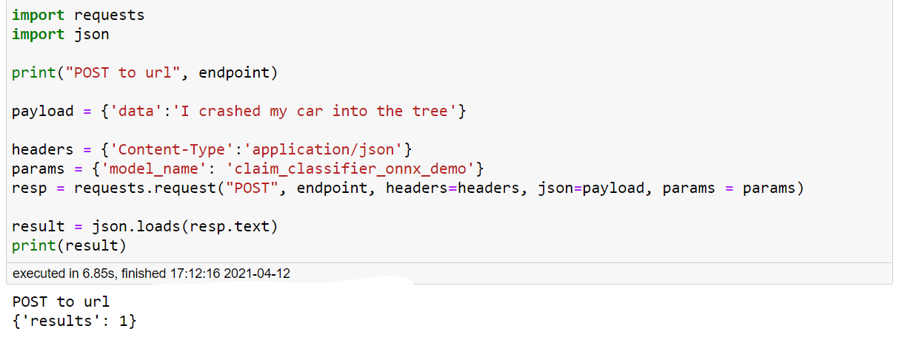
    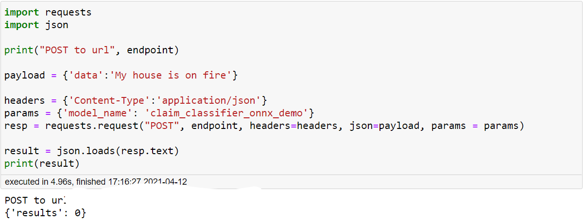

## License

MIT License

Copyright (c) 2021 HZ-MS-CSA

Permission is hereby granted, free of charge, to any person obtaining a copy
of this software and associated documentation files (the "Software"), to deal
in the Software without restriction, including without limitation the rights
to use, copy, modify, merge, publish, distribute, sublicense, and/or sell
copies of the Software, and to permit persons to whom the Software is
furnished to do so, subject to the following conditions:

The above copyright notice and this permission notice shall be included in all
copies or substantial portions of the Software.

THE SOFTWARE IS PROVIDED "AS IS", WITHOUT WARRANTY OF ANY KIND, EXPRESS OR
IMPLIED, INCLUDING BUT NOT LIMITED TO THE WARRANTIES OF MERCHANTABILITY,
FITNESS FOR A PARTICULAR PURPOSE AND NONINFRINGEMENT. IN NO EVENT SHALL THE
AUTHORS OR COPYRIGHT HOLDERS BE LIABLE FOR ANY CLAIM, DAMAGES OR OTHER
LIABILITY, WHETHER IN AN ACTION OF CONTRACT, TORT OR OTHERWISE, ARISING FROM,
OUT OF OR IN CONNECTION WITH THE SOFTWARE OR THE USE OR OTHER DEALINGS IN THE
SOFTWARE.
