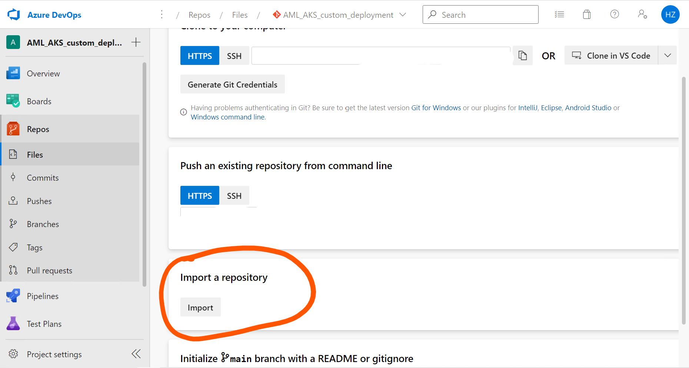

MIT License

Copyright (c) 2021 HZ-MS-CSA

Permission is hereby granted, free of charge, to any person obtaining a copy
of this software and associated documentation files (the "Software"), to deal
in the Software without restriction, including without limitation the rights
to use, copy, modify, merge, publish, distribute, sublicense, and/or sell
copies of the Software, and to permit persons to whom the Software is
furnished to do so, subject to the following conditions:

The above copyright notice and this permission notice shall be included in all
copies or substantial portions of the Software.

THE SOFTWARE IS PROVIDED "AS IS", WITHOUT WARRANTY OF ANY KIND, EXPRESS OR
IMPLIED, INCLUDING BUT NOT LIMITED TO THE WARRANTIES OF MERCHANTABILITY,
FITNESS FOR A PARTICULAR PURPOSE AND NONINFRINGEMENT. IN NO EVENT SHALL THE
AUTHORS OR COPYRIGHT HOLDERS BE LIABLE FOR ANY CLAIM, DAMAGES OR OTHER
LIABILITY, WHETHER IN AN ACTION OF CONTRACT, TORT OR OTHERWISE, ARISING FROM,
OUT OF OR IN CONNECTION WITH THE SOFTWARE OR THE USE OR OTHER DEALINGS IN THE
SOFTWARE.


# aml_model_aks_custom


1. conda env create -f project_env.yml

2. conda activate project_environment

3. Provide the necessary environment variables at run time

    1. TENANT_ID
    2. CLIENT_ID
    3. CLIENT_SECRET
    4. WORKSPACE_NAME
    5. SUBSCRIPTION_ID
    6. RESOURCE_GROUP

4. python main-generic.py (Start flask app)

5. Send a post query with the following requirements

    1. Body is set to json string with the following structure: {'data': RAW_DATA}
    2. headers = {'Content-Type':'application/json'}
    3. params = {'model_name': MODEL_NAME}
    


# Step by Step Instructions


## Set up Azure Devops Project


1. Go to [Azure Devops website](https://azure.microsoft.com/en-us/services/devops/?nav=min), and set up a project named **AML_AKS_custom_deployment** (Substitute any name as you see fit.)


## Set up Project


1. Go to Repos on the left side, and find **Import** under **Import a repository**



2. Use https://github.com/HZ-MS-CSA/aml_aks_generic_model_deployment as clone URL


## Upload AML Model


1. As a demonstration, we will be using an onnx model from a Microsoft Cloud Workshop activity. 
    1. "This is a classification model for claim text that will predict `1` if the claim is an auto insurance claim or `0` if it is a home insurance claim. The model will be built using a type of Deep Neural Network (DNN) called the Long Short-Term Memory (LSTM) recurrent neural network using TensorFlow via the Keras library.". [Source here.](https://github.com/microsoft/MCW-Cognitive-services-and-deep-learning/blob/main/Hands-on%20lab/notebooks/03%20Claim%20Classification.ipynb)
    2. For step by step guidance on how to create and train this model, please see the [MCW workshop here.](https://github.com/microsoft/MCW-Cognitive-services-and-deep-learning) 
    3. For your convenience, you can find the onnx model under sample_model/claim_classifer.zip
    4. Download and unzip the file, and upload the onnx model to Azure ML workspace
    
    


## Modify Azure Devops Repo Content


There are two files that need to be modified to accommodate the onnx model

1. **./main-generic.py**: This is essentially a scoring entry script that calls AML SDK, retrieve the model from the registry, and wrap it in a flask API. The original main-generic.py is a template, and you can add any relevant codes to execute the model in this file. Please replace the content of this file with **./sample_model/main-generic.py** (An example of how to customize this python script)
2. **./project_env.yml**: This specifies the dependencies required for the model to execute. Please replace the content of this file with **./sample_model/project_env.yml** (An example of how to customize this yml file)

```python

```
